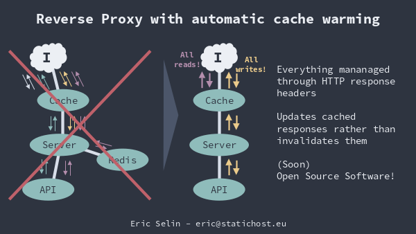

# Always-Cache

`Always-Cache` is an HTTP cache aiming for 100% cache hit ratio for read requests. This is possible with the following core features:

1. *Update cache instead of invalidating.* When data changes, update the cached responses for all affected URLs.
2. *Pre-cache everything.* On initialization, pre-cache the responses for all possible URLs.

Caching behavior (such as content expiry) is controlled via HTTP response headers like any other cache.



## Introducing the idea at the Nordic.JS 2022 conference

<iframe width="560" height="315" src="https://www.youtube-nocookie.com/embed/VLAuJO9ivOk" title="YouTube video player" frameborder="0" allow="accelerometer; autoplay; clipboard-write; encrypted-media; gyroscope; picture-in-picture" allowfullscreen></iframe>

[Slides](intro-nordicjs-2022/100-http-cache-hit-rate-ericselin.pdf) [Transcript-ish](intro-nordicjs-2022/100-http-cache-hit-rate-ericselin.md)

## Efficient cache updating

The caching behavior of `Always-Cache` is managed mainly via response headers - just like any other HTTP cache. Cache entries are updated both automatically when the content is about to become stale, and on demand when content is updated (e.g. via a `POST` request).

### Automatic updates of stale content

Before a cached response becomes stale, the cache is updated with a new response. This behavior is described in the HTTP Caching RFC. You can specify your desired caching with the standard `Cache-Control` header or the custom `Always-Cache-Control` header. The advantage of the latter is that it only affects `Always-Cache` and is not sent to the client.

### On-demand updates of updated content

Cached URLs that need to be updated are defined in the `Always-Cache-Update` header. For instance, when a client issues a `POST` request to your backend that updates data shown on `/index.html`, just pass that URL in the header. (Standard HTTP caching does not take into account how to invalidate (i.e. pruge) content from caches, which is a shame.)

## Pre-caching, i.e. cache warming

> Pre-caching is not yet ported to open source version

Traditionally, HTTP caches store responses when requests come in for a particular URL. However, serving cached content means even the first request should be served from cache. `Always-Cache` will therefore cache the entire site or API before any requests come in. You can think of this as Ahead-Of-Time caching instead of Just-In-Time caching. Or simply "pre-caching" or "cache warming".

In order for pre-caching to work, `Always-Cache` needs to know all possible URLs in order to cache them. URLs are collected from the following sources:

- `/sitemap.xml`: Regular XML sitemap for HTML pages, optionally with Google image and video extensions. May also be a sitemap index listing other sitemaps.
- `/sitemap.txt`: Text version of sitemap, with one URL per line.
- Sitemap defined in `/robots.txt`: Either XML or text sitemap per above.
- `/urls.txt`: List of URLs, with one URL per line.

Note that any URLs not listed in the sitemap (which is meant to list HTML pages for search engines) should be included in `urls.txt`. This includes any static assets, such as images, CSS and JS.

## Controlling caching behavior

The caching behavior of `always-cache` is controlled via HTTP headers. The specific headers used differ between read requests (e.g. GET) that should always be served from cache, and write requests (e.g. POST) that change data and content and should be sent to the downstream server.

### Read requests

Successful `GET` requests are always cached (except if explicitly forbidden). The caching behavior is set in the `Cache-Control` header, and follows the HTTP caching standard (RFC 7234). **Currently, the only supported directive in the open source version is `max-age`. The `Always-Cache-Control` header is not yet supported.**

#### `Cache-Control` header

Syntax:

```
Cache-Control: <directive>+
```

Directives:

- `max-age=N`: consider the response "fresh" for *N* seconds.
- `no-cache`: do not cache the response. **not implemented**

Example:

```
Cache-Control: max-age=3600
```

### Write requests

> Write request handling is not yet ported to the open source version

Write requests (requests that change data) are never cached. However, by their very nature, these requests change data in some way. This means that cached responses most probably need to be updated. As per the RFC recommendation, the current page is updated by default. I.e. `POST /blog-posts/my-blog-post` will update the cache for `GET /blog-posts/my-blog-post`. Oftentimes there is also a need to update a list page or some other page(s) as well (e.g. `/blog-posts/all`. This can be achieved with the `Cache-Update` header.

#### `Cache-Update` header

Syntax:

```
Cache-Update: [ <url-path> | <directive>+ ]
```

If no URL path (`<url-path>`) is specified, the directives take effect on the current url.

Directives:

- `no-wait`: finish the response without waiting for updates to conclude. **not implemented**
- `no-update`: do not update the cache (useful only for the current URL, of course). **not implemented**
- `delay=N`: delay updating the cache by *N* seconds; implies `no-wait`. **not implemented**

Example:

```
Cache-Update: no-wait; /blog-posts/all delay=5
```

## Usage

> Running `always-cache` as a standalone proxy or as a [Caddy](https://caddyserver.com) plugin is planned, but not yet finished.

Use `always-cache` as a standard middleware in your Golang HTTP server:

```go
package main

import (
  "fmt"
	"net/http"
	"time"

	"github.com/ericselin/always-cache"
)

func main() {
	acache := cache.New(cache.Config{
		DefaultMaxAge: 5 * time.Minute,
	})

  handler := http.HandlerFunc(func(w http.ResponseWriter, r *http.Request) {
    fmt.Fprintf(w, "Hello, %q", r.URL.Path)
  })

	http.ListenAndServe(":8080", acache.Middleware(handler))
}
```

## Background

The idea for `always-cache` was - as with many things - born from personal needs. While working with a client, it became pretty much impossible to serve user requests faster than in about one second (yes) without caching. Instead of relying on traditional web app -based caching, HTTP caching was instead used for simplicity. That HTTP caching work became the beginning of this open source solution. See the [introductory talk at Nordic.JS 2022](https://youtu.be/VLAuJO9ivOk).

## Tips

- Use long max-age -> this is the whole point of `Always-Cache`
- Understand how caching works or use sane defaults
- For dynamic content and data, use the `Always-Cache-Control` header to avoid CDN problems

## Contributing

Contributions are always welcome! Whatever they might be. If you star this repo, that is already a big contribution! 😉

The best way to get started is to contact me directly. Please do that!
